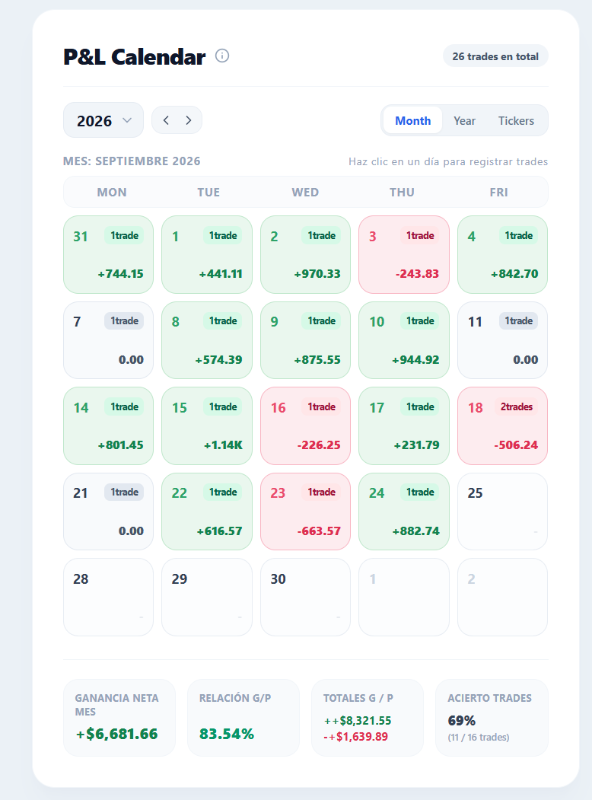
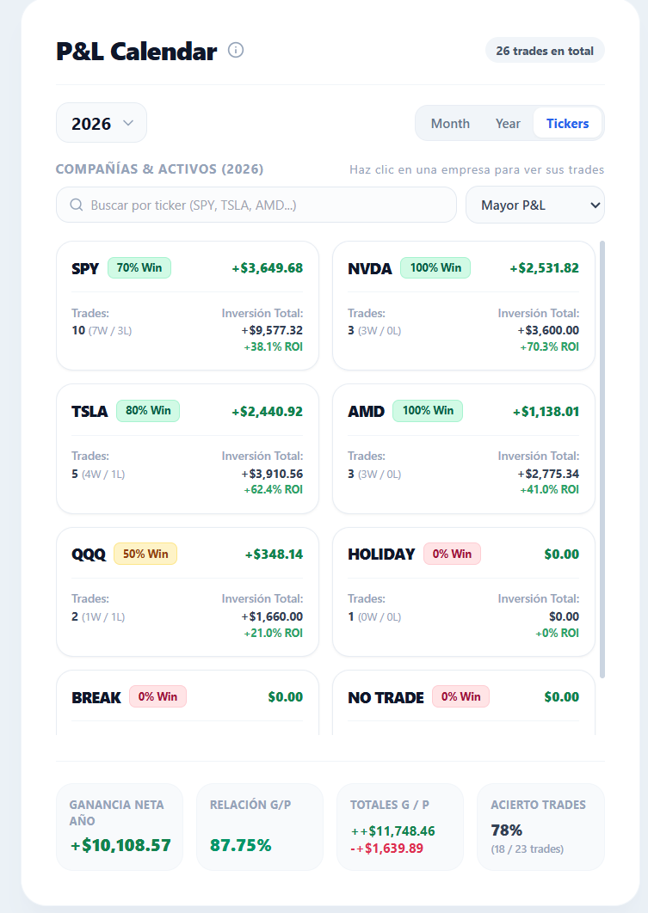
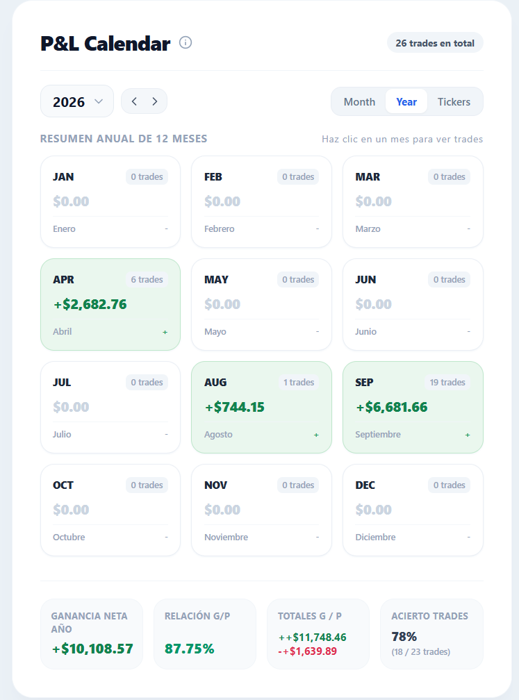
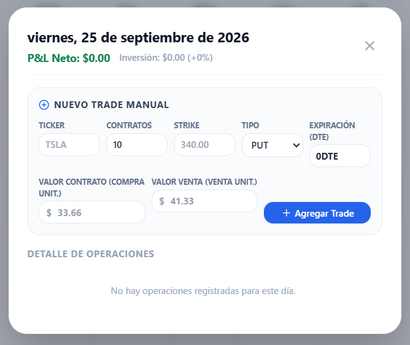

# 📈 P&L Calendar & Options Trading Journal

Un diario de trading interactivo y visual para opciones financieras y acciones, diseñado para monitorear ganancias y pérdidas diarias (P&L), tasas de acierto y estadísticas oficiales con la fórmula de **Charles Schwab / Thinkorswim**.

Construido como una Single Page Application (SPA) en **HTML5, Tailwind CSS y JavaScript Vanilla**, sin dependencias de servidor (todo corre 100% en el navegador con persistencia en `localStorage`).

---

## 📸 Capturas de Pantalla

### 1. Vista Mensual (Trading P&L Calendar)
Calendario interactivo de lunes a viernes con celdas diferenciadas por colores pastel para ganancias y pérdidas, conteo de trades y la etiqueta dinámica **Today** en el día actual:

<p align="center">
  
</p>

### 2. Resumen por Compañías Operadas (Pestaña Tickers)
Desglose detallado por activo (`TSLA`, `SPY`, `AMD`, `NVDA`, `QQQ`), con conteo exacto de **trades ganados vs. perdidos (W/L)**, tasa de acierto porcentual (**Win Rate %**), capital total invertido y balance neto acumulado:

<p align="center">
  
</p>

### 3. Vista Anual (12 Meses)
Resumen consolidado de enero a diciembre con el cálculo acumulado en tiempo real del P&L neto y volumen de operaciones por mes:

<p align="center">
  
</p>

### 4. Detalle de Operaciones & Métricas por Contrato
Desglose financiero por operación: número de contratos (`Qty`), `Strike` limpio, tipo (`CALL/PUT`), expiración calculada (`0DTE`, `1DTE`), valor de compra unitario, precio de venta y retorno porcentual (`ROI %`):

<p align="center">
  
</p>

---

## 🏢 Análisis de Trades por Compañía (Pestaña Tickers)

La pestaña **Tickers** agrupa de forma automática todas las transacciones según el activo subyacente operado para responder de un vistazo qué empresas son las más rentables de tu portafolio:

- **Ratio de Acierto (W / L):** Visualiza cuántos trades cerraron en positivo y cuántos en negativo para cada acción (por ejemplo: `12W / 2L`).
- **Insignias de Win Rate Dinámicas:**
  - 🟢 **Verde (>= 70%):** Compañías de alta consistencia y efectividad.
  - 🟡 **Amarillo (50% - 69%):** Rendimiento moderado.
  - 🔴 **Rojo (< 50%):** Compañías con predominancia de trades perdedores.
- **Inversión Total vs. Beneficio Neto:** Registra la suma total de prima desembolsada (*Cost Basis*) junto con el **P&L Neto ($)** y el porcentaje de retorno sobre capital (**ROI %**).
- **Buscador y Ordenamiento:** Filtra al instante por símbolo y clasifica por:
  - *Mayor P&L* o *Menor P&L*
  - *Mayor número de Trades realizados*
  - *Mayor Win Rate %*
- **Modal de Historial Individual:** Al hacer clic sobre cualquier tarjeta de compañía, se despliega una ventana modal con el historial cronológico completo de todas las operaciones realizadas exclusivamente en ese activo.

---

## 🚀 Características Principales

- **Calendario Dinámico (Lunes a Viernes):**
  - Muestra exclusivamente días operativos de mercado (de lunes a viernes).
  - Fondo verde pastel y texto esmeralda para días con ganancias; fondo rojo pastel para días negativos.
  - Indicador dinámico **"Today"** exclusivo en el día en curso del sistema.
  - Conteo de operaciones cerradas en la esquina superior de cada día (`1 trade`, `2 trades`, etc.).
- **Compatibilidad Nativa con Charles Schwab / Thinkorswim:**
  - Importador inteligente de archivos CSV (`GainLoss_Realized_Details.csv`).
  - Detección automática del encabezado ignorando filas de metadatos del broker.
  - Modo **Fusión inteligente:** suma nuevos reportes sin sobreescribir los datos previos ni duplicar registros.
- **Desglose de Opciones Financieras:**
  - Extracción de **Ticker**, **Strike limpio** (sin `$`), tipo (**CALL / PUT**) y número de contratos (**Qty**).
  - Cálculo matemático exacto de **DTE** (`0DTE`, `1DTE`, `2DTE`, etc.) comparando fecha de apertura (`Opened Date`) y fecha de expiración.
  - Precios unitarios: Costo por contrato de compra (`Cto Compra`) y precio de venta (`Cto Venta`).
  - Cálculo del retorno porcentual de la posición (**ROI %**).
- **Métricas Oficiales de Charles Schwab:**
  - **Relación Ganancia/Pérdida:** Calculada mediante la fórmula oficial de volumen:
    $$\text{Relación G/P} = \frac{\text{Ganancias Brutas}}{\text{Ganancias Brutas} + \vert{}\text{Pérdidas Brutas}\vert{}} \times 100$$
  - Desglose de Ganancias Brutas (`+$$$`) y Pérdidas Brutas (`-$$$`).
  - Tasa de acierto de trades (`Win Rate %`).
- **Resumen Anual (12 Meses):**
  - Tarjetas de enero a diciembre con el P&L acumulado y el número total de trades por mes.
- **Privacidad y Persistencia:**
  - Todos los datos se almacenan localmente en el navegador (`localStorage`). No se envían datos a ningún servidor externo.

---

## 🛠️ Tecnologías Utilizadas

- **HTML5 semántico**
- **[Tailwind CSS (CDN)](https://tailwindcss.com/):** Estilos modernos, diseño responsive y paleta pastel personalizada.
- **[Lucide Icons](https://lucide.dev/):** Iconografía moderna y ligera.
- **[PapaParse](https://www.papaparse.com/):** Procesamiento y parseo rápido de archivos CSV en el cliente.
- **JavaScript (ES6+):** Lógica reactiva sin frameworks pesados.

---

## 📂 Formato de CSV Soportado

El analizador está preparado para reportes de ganancias realizadas de brokers (formato Charles Schwab):

| Columna | Descripción |
| :--- | :--- |
| `Symbol` | Símbolo estándar de opciones (ej. `TSLA 04/08/2026 340.00 P`) |
| `Opened Date` | Fecha de apertura (`MM/DD/YYYY`) |
| `Closed Date` | Fecha de cierre (`MM/DD/YYYY`) |
| `Quantity` | Cantidad de contratos operados |
| `Cost Basis (CB)` | Capital total invertido en la posición |
| `Proceeds` | Monto total recibido al cerrar la posición |
| `Gain/Loss ($)` | Ganancia o pérdida neta |

---


```bash
git init
git add .
git commit -m "feat: Add P&L Trading Calendar with ticker analytics"
git branch -M main
git remote add origin [https://github.com/TU-USUARIO/trading-pnl-calendar.git](https://github.com/TU-USUARIO/trading-pnl-calendar.git)
git push -u origin main
